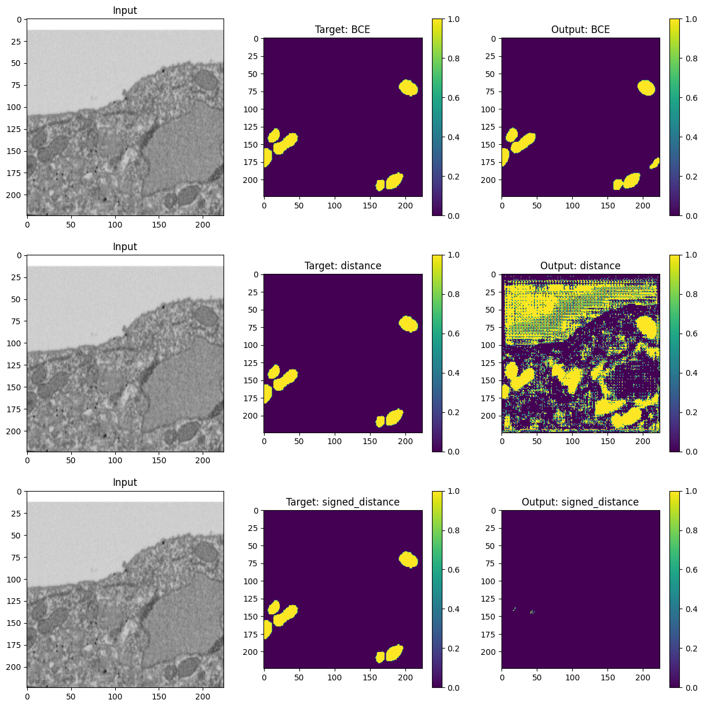

# Binary Cross-Entropy versus MSE on Distance and Signed-distance

This repository contains the code for the study "Binary Cross-Entropy versus MSE on Distance and Signed-distance" by Jeff Rhoades (@rhoadesScholar), accepted by the FAAFO Consortium of Rhoades.

## Goal

This is an observational study to determine the effect of using Binary Cross-Entropy (BCE) loss on binary labels versus Mean Squared Error (MSE) loss on distance and signed-distance for semantic segmentation of FIBSEM images. The study is motivated by the computational and algorithmic complexities introduced by the use of distance and signed-distance in model training. The question is: Is it worth the effort to use distance and signed-distance in a regressive task (MSE), instead of simply using binary targets (BCE)?

## Findings

The results show that using distance and signed-distance as targets in a regressive task (MSE) does not improve the performance of the model compared to using binary targets (BCE). The results suggest that the computational and algorithmic complexities introduced by the use of distance and signed-distance are not worth the effort in this context. In fact, the results show that using distance and signed-distance as targets can lead to worse performance compared to using binary targets. This may not be the case for objects with more complex shapes (for instance thin, elongated and/or branching, such as neurons or endoplasmic reticulum), but for the simple shapes of mitochondria in FIBSEM images, binary targets are sufficient.



## Setup

To install the required packages, run the following command from the root directory of this repository:

```bash
micromamba env create -n BvE python==3.11 -f requirements.txt -c pytorch -c nvidia -y
micromamba activate BvE
pip install -e .
```

## Data

The data used in the paper is from "Instance segmentation of mitochondria in electron microscopy images with a generalist deep learning model" by Ryan Conrad and Kedar Narayan. See https://volume-em.github.io/empanada.html for more information. The data is not included in this repository, but can be downloaded from:
- https://doi.org/10.6019/EMPIAR-11037 (CEM-MitoLab)
- https://doi.org/10.6019/EMPIAR-11035 (CEM1.5M).
<!-- - https://doi.org/10.6019/EMPIAR-10982 (Seven benchmark datasets of instance segmentation of mitochondria) -->

It is faster to navigate to the websites above, but these datasets can also be downloaded and extracted to the `data` directory by running the following commands:

```bash
python data/download.py
```

This will download the data to the `data` directory, unzip it to the same directory, and randomly split the Mito-Lab data into training, validation, and test sets (80%, 15%, and 5%, respectively).

