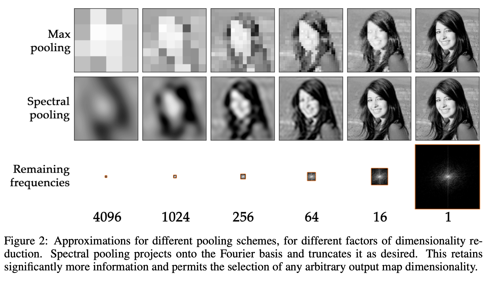

# Fourier Space Segmentation

This repository contains the code for the study "Fourier Space Segmentation" by Jeff Rhoades (@rhoadesScholar), accepted by the FAAFO Consortium of Rhoades.

## Goal

This is an observational study to determine the feasibility of using a Fourier space representation of an image to segment objects in the image. The Fourier transform represents an image in terms of its frequency components (both spatial and temporal). The key idea is that certain patterns or objects might be better recognized in the frequency domain rather than the spatial domain.
	•	Localized patterns: Objects with certain symmetry, periodicity, or frequency characteristics might be more easily recognized in the Fourier domain.
	•	Noise reduction: The Fourier transform can help in removing high-frequency noise and emphasizing low-frequency components that carry more of the object’s global structure.
	•	Invariance: Fourier representations can be more invariant to certain transformations like rotation or scaling, depending on the type of transform used.

Fourier domain for object recognition has been explored in specialized areas such as:
	•	Texture recognition: Fourier transforms are often used for analyzing textures, where periodic patterns are key.
	•	Motion recognition: For video or time-series images, the Fourier domain might help capture temporal patterns.
	•	Pattern matching: In cases where objects have specific frequency signatures, such as certain shapes or repetitive patterns, the Fourier domain could help.

Consider the information density over the course of downsampling, for instance (taken from "Spectral Representations for Convolutional Neural Networks" by Rippel et al., 2015):


The study uses the Mito-Lab dataset to segment mitochondria in electron microscopy images.

## Findings

TBD

Below are thresholded masks of the GT targets and associated the model's output.


## Setup

To install the required packages, run the following command from the root directory of this repository:

```bash
micromamba env create -n fss python==3.11 -f requirements.txt -c pytorch -c nvidia -y
micromamba activate fss
pip install -e .
```

## Model

Uses MONAI's implementation of a ViT Autoencoder based on [An Image is Worth 16x16 Words: Transformers for Image Recognition at Scale](https://arxiv.org/abs/2010.11929)

## Data

The data used in the paper is from "Instance segmentation of mitochondria in electron microscopy images with a generalist deep learning model" by Ryan Conrad and Kedar Narayan. See https://volume-em.github.io/empanada.html for more information. The data is not included in this repository, but can be downloaded from:
- https://doi.org/10.6019/EMPIAR-11037 (CEM-MitoLab)
- https://doi.org/10.6019/EMPIAR-11035 (CEM1.5M).
<!-- - https://doi.org/10.6019/EMPIAR-10982 (Seven benchmark datasets of instance segmentation of mitochondria) -->

It is faster to navigate to the websites above, but these datasets can also be downloaded and extracted to the `data` directory by running the following commands:

```bash
python data/download.py
```

This will download the data to the `data` directory, unzip it to the same directory, and randomly split the Mito-Lab data into training, validation, and test sets (80%, 15%, and 5%, respectively).

