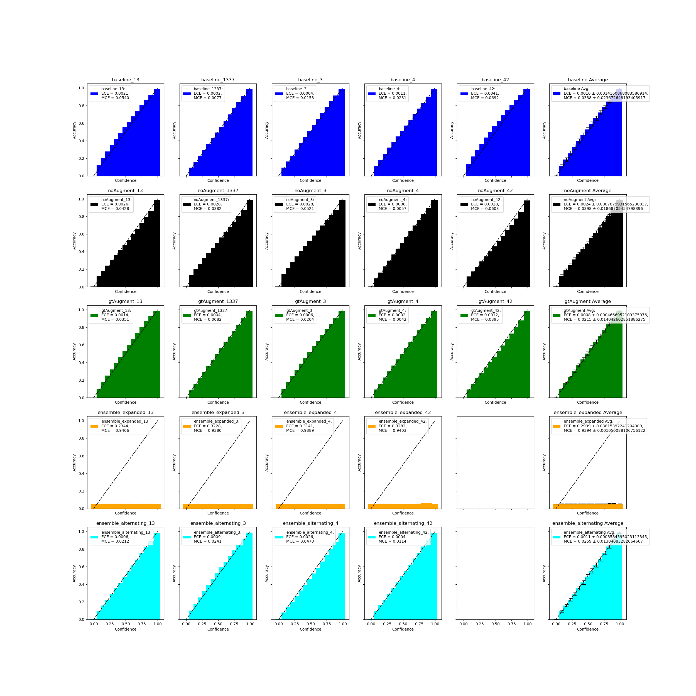

# Knowledge Expansion via Error Distribution Prediction

This repository contains the code for the study "Knowledge Expansion via Error Distribution Prediction" accepted by the FAAFO Consortium of Rhoades.

## Hypothesis

I hypothesize that a teacher model can predict the error distribution of a student model, and that this prediction can be used to improve the student model's performance. Specifically, a student model that has been trained with a teacher model's error distribution prediction alongside actual groundtruth (GT) data, as well as on an external, unlabeled, dataset, will outperform other student models in terms of accuracy and Expected Calibration Error (ECE).

## Findings
<!-- TODO: Add figures -->
The results of this study suggest that training a student model with a teacher model's error distribution prediction does not improve the student model's performance. Particularly, the student model trained with the teacher model's error distribution prediction on an external, unlabeled, dataset, drastically degraded the performance of the student model. The student model trained with the teacher model's error distribution prediction alongside actual GT data performed similarly to the student model trained with only GT data. This effect was not improved by use of an ensemble of teacher models.

Additionally, I experimented with randomly augmenting the GT masks during student training, and found that this did not largely affect the performance of the student model. If anything, it improved the ECE of the student model.



## Setup

To install the required packages, run the following command from the root directory of this repository:

```bash
micromamba env create -n KE python==3.11 -f requirements.txt -c pytorch -c nvidia -y
micromamba activate KE
pip install -e .
```

## Data

The data used in the paper is from "Instance segmentation of mitochondria in electron microscopy images with a generalist deep learning model" by Ryan Conrad and Kedar Narayan. See https://volume-em.github.io/empanada.html for more information. The data is not included in this repository, but can be downloaded from:
- https://doi.org/10.6019/EMPIAR-11037 (CEM-MitoLab)
- https://doi.org/10.6019/EMPIAR-11035 (CEM1.5M).
<!-- - https://doi.org/10.6019/EMPIAR-10982 (Seven benchmark datasets of instance segmentation of mitochondria) -->

It is faster to navigate to the websites above, but these datasets can also be downloaded and extracted to the `data` directory by running the following commands:

```bash
python data/download.py
```

This will download the data to the `data` directory, unzip it to the same directory, and randomly split the Mito-Lab data into training, validation, and test sets (80%, 15%, and 5%, respectively).

## Training
Several models are trained, and each training is replicated with 5 unique seeds. The models are as follows:

### Teacher
In general:

The teacher model, a ViT from monai, is trained to predict the Binary cross-entropy (BCE) loss on 80% of CEM-MitoLab, validated on 15%, and tested on 5%. It receives the raw image data and label masks as input and predicts the BCE loss. Loss is calculated both for actual groundtruth masks, as well as for augmented/predicted masks. A ratio is used to weight the contributions of these to gradient calculations (currently 1:9). Two different teacher conditions exist (see below):

#### Pretraining
The teacher model is pretrained using random augmentations of the ground truth masks (i.e. RandomErase, perspective, etc.), using mean absolute error (MAE) to avoid overfitting the teacher to 0-error predictions (which will always happen for the GT data). The pretrained model is saved to `models/teacher_pretrained_{seed}.pth`.

#### Joint-Training
During joint-training, the pretrained teacher model is further trained to predict the BCE loss of a student model, alongside training on the ground truth (GT) masks of the same data. This model is saved to `models/teacher_joint_{seed}.pth`.

### Student
In general:

The student model, a Swin UNETR based on: “Hatamizadeh et al., Swin UNETR: Swin Transformers for Semantic Segmentation of Brain Tumors in MRI Images <https://arxiv.org/abs/2201.01266>” from monai, is generally trained with BCE loss on 80% of CEM-MitoLab, validated on 15%, and tested on 5%. This model recieves raw image data as input, and outputs a prediction for the label mask. Three different student conditions exist (see below):
1) Baseline
2) Teacher joint-training
3) Knowledge expansion

#### Baseline
This student model is trained from scratch with BCE loss on 80% of CEM-MitoLab, validated on 15%, and tested on 5%. The student model is saved to `models/student_baseline_{seed}.pth`.

#### Teacher Joint-Training
The student model is trained from scratch alongside the teacher model, while using the actual BCE loss from the groundtruth masks. Because the teacher and student losses are combined before calculating gradients, the student also receives a learning signal based on how well the teacher could predict its error. This should encourage it to collaborate with the teacher, likely by making mistakes for which the teacher is good at predicting the error. The student model is saved to `models/student_joint_{seed}.pth`.

#### Knowledge Expansion
The joint-trained student model is further trained with the teacher model's BCE loss prediction on the entire CEM1.5M(CEM1500k_unlabelled) dataset. The student model is saved to `models/student_expansion_{seed}.pth`.

### Commitee Expansion
The joint-trained student models are also trained with all teacher models' BCE loss prediction on the entire CEM1.5M(CEM1500k_unlabelled) dataset. The student model is saved to `models/student_ensemble_expanded_{seed}.pth`.

# Optimizer and Learning Rate Scheduler
The same optimizer and learning rate scheduler are used for all models. The models are trained for 100 epochs with a batch size of 16. The learning rate is reduced by a factor of 0.1 every 25 epochs.

# Augmentations
The following augmentations are used for training all models:
- RandomAffine
- RandomHorizontalFlip
- RandomVerticalFlip
- RandomResizedCrop

Augmentations applied to the raw image data during training include:
- GaussianBlur
- ColorJitter (brightness and contrast)

Augmentations applied to the GT masks for the pseudo-prediction condition during teacher pretraining include:
- RandomAffine
- RandomErasing
- RandomResizedCrop
- RandomHorizontalFlip
- RandomVerticalFlip
- RandomPerspective
- GaussianBlur
