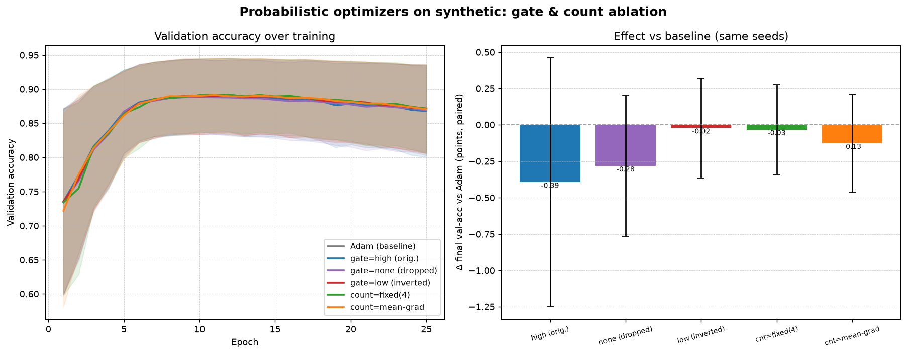

# Probabilistic Optimizers

This repository contains the code for the study "Probabilistic Optimizers:
gradient-weighted parameter resampling as a drop-in exploration hook" by Jeff
Rhoades (@rhoadesScholar), submitted to the FAAFO Consortium of Rhoades.

## Idea

Take **any** off-the-shelf optimizer (Adam, SGD, ...) and, after each ordinary
update, inject a hook that randomly **resamples ("mutates") individual
parameters, per layer**. The recipe, applied to each parameter tensor:

1. Look at the per-entry gradient magnitude `|g|`.
2. A **gate** decides which entries are *eligible* to mutate: `"high"` (`|g|`
   over a threshold — the still-moving, contested entries), `"low"` (`|g|` under
   the threshold — the stuck / near-dead entries), or `"none"` (drop the gate).
3. Turn the eligible magnitudes into probabilities with a temperature-scaled
   **softmax over the layer** (`weight_by="grad"` gives high-gradient entries
   more mass; `"neg_grad"` favours the small ones).
4. Draw independent Bernoulli mutation decisions from those probabilities,
   scaled so that ~`num_mutations` entries mutate per layer in expectation.
   `num_mutations` can be a constant *or* adaptive (a fraction of the entries
   over the gate, or a multiple of the mean/max gradient).
5. Replace (or perturb) the chosen entries with a **mutator**: a draw from a
   distribution (Gaussian, uniform), a **deterministic chaotic function** (the
   logistic map), or any callable you supply.

The result is a *family* of optimizers — one per (base optimizer × mutator ×
schedule) combination — that behave like the wrapped optimizer but with a tunable
amount of gradient-weighted stochastic exploration folded in.

```python
import torch
from ProbabilisticOptimizers import ProbabilisticOptimizer, ChaoticMutator

base = torch.optim.Adam(model.parameters(), lr=1e-3)
opt = ProbabilisticOptimizer(
    base,
    mutator=ChaoticMutator(additive=True, strength=1e-2),
    threshold=1e-3,      # only mutate high-gradient entries
    num_mutations=2.0,   # ~2 mutated entries per layer per step (in expectation)
    temperature=1.0,     # softmax temperature over |grad|
)
# ...then use `opt` exactly like a normal optimizer.
```

There is also a class factory for the "swap `Adam` for `ProbabilisticAdam`" style:

```python
from ProbabilisticOptimizers import make_probabilistic
ProbAdam = make_probabilistic(torch.optim.Adam)
opt = ProbAdam(model.parameters(), lr=1e-3, num_mutations=2.0)
```

## What the mutation rule actually does

A subtle but important consequence of gating on **high** gradients: at a local
minimum the gradients are ~0 everywhere, so *nothing is eligible* and no mutation
happens. This method therefore does **not** kick a settled model out of a
minimum. Instead it injects exploration **during active descent** — high
gradient magnitude behaves like a high "temperature", much as in simulated
annealing — and biases that exploration toward the entries that are currently
moving the most. Best-so-far tracking then keeps whatever good basin the noisy
trajectory happens to pass through.

## Mutators

| Mutator | Behaviour |
| --- | --- |
| `NormalMutator(std, mean, relative, additive)` | Draw from `Normal(mean, std)`; `relative` scales `std` by `|weight|`. |
| `UniformMutator(low, high, additive)` | Draw from `Uniform(low, high)`. |
| `ChaoticMutator(r, iterations, scale, additive)` | Deterministic logistic-map chaos, seeded from `weight + grad`. No PRNG. |
| `CallableMutator(fn, additive)` | Wrap any `fn(values, grads, generator)`. |

All mutators support `additive=True` (perturb the current value) vs. the default
`additive=False` (fully replace it), and a `strength` multiplier that can be
annealed over training.

## Gates, weighting, and adaptive counts

| Knob | Values | Meaning |
| --- | --- | --- |
| `gate` | `"high"` / `"low"` / `"none"` | Which entries are eligible: over the gate, under it, or all. |
| `threshold_mode` | `"abs"` / `"quantile"` | Interpret `threshold` as an absolute `|grad|` or as a per-layer quantile (scale-free; e.g. `0.5` splits each layer at its median gradient). |
| `weight_by` | `"grad"` / `"neg_grad"` | Softmax mass on large vs. small gradients. |
| `num_mutations` | float or callable | Expected mutations per layer, fixed or adaptive. |

Adaptive count strategies (`ProbabilisticOptimizers.mutation_counts`) make the
per-step budget *react* to the gradients:

```python
from ProbabilisticOptimizers import FractionOverGate, GradientScaled

# ~2% of the entries that pass the gate, this step:
num_mutations = FractionOverGate(fraction=0.02)
# scale the count by the mean |grad| (cap it — see the warning below):
num_mutations = GradientScaled(scale=1500.0, stat="mean", max_count=80.0)
```

## Findings

### 1. Non-convex optimisation (Rastrigin)

Benchmark: minimise the **Rastrigin** function (a grid of deep local minima
around a single global minimum at 0) from 60 random starts, wrapping Adam
(`lr=0.05`, 600 steps) with `threshold=0.5`, `num_mutations=3`, `temperature=2`,
and mutation magnitude annealed to 2% over training. We report the best-so-far
loss reached (lower is better).


| Method | median final | mean final | escape rate (<1.0) |
| --- | ---: | ---: | ---: |
| Adam (baseline) | 25.4 | 24.4 | 3.3% |
| Prob-Adam + Gaussian | 20.5 (**−19%**) | 23.5 | 0% |
| Prob-Adam + Uniform | 17.5 (**−31%**) | 23.0 | 0% |
| Prob-Adam + Chaotic | 47.1 (**+86%**) | 48.3 | 0% |

The result is **mixed, and instructive**:

* **Gradient-weighted Gaussian/uniform resampling improves the typical case.**
  It cuts the *median* final loss by ~20–30% relative to vanilla Adam: the
  gradient-biased noise nudges the descent trajectory into modestly better local
  basins more often than not.
* **It does not improve the rate of finding the global optimum** (escape rate
  stays ~0). This follows directly from the design: because only *high-gradient*
  entries are eligible to mutate, at a settled local minimum — where all
  gradients are ~0 — nothing is eligible, so the hook cannot kick a converged
  model out of a basin. The exploration all happens *during* descent, not after
  it stalls. (Adam's lone 3.3% is 2/60 lucky starts, i.e. noise.)
* **The deterministic chaotic mutator hurts** (+86% median loss). Its
  structured, geometry-blind jumps are a poor match for this landscape; simple
  distribution draws beat it handily.

Takeaway for the "find out" ledger: framing mutation eligibility on *high*
gradient magnitude makes this a **descent-time exploration** trick (a
gradient-aware cousin of injecting annealed noise) rather than a
minimum-escaping one. If escaping stalled minima is the goal, the eligibility
rule should be inverted or the gate dropped — which motivated the next stunt.

### 2. Neural-network training — gate & count ablation

An actual training run (see *Running a training run* below): a small MLP on a
synthetic teacher-student classification task with **20% training-label noise**
and a small train set, so the network overfits and there is a real
generalisation gap to move. Adam (`lr=1e-3`) is wrapped with a ~30%-relative
Gaussian perturbation. We compare, over 6 seeds, the **gate** (high / none /
inverted) and the **mutation-count** strategy. Because task difficulty varies a
lot across seeds, we report the **paired** delta vs Adam (same seed).



| Config | Δ final val-acc vs Adam (paired) | mut/step |
| --- | ---: | ---: |
| `gate=high` (original) | −0.39 ± 0.86 pts | 211 |
| `gate=none` (dropped) | −0.28 ± 0.48 pts | 422 |
| `gate=low` (inverted) | −0.02 ± 0.34 pts | 211 |
| `count=fixed(4)` | −0.03 ± 0.31 pts | 24 |
| `count=mean-grad` | −0.13 ± 0.33 pts | 33 |

What we found — and it partly **contradicts the going-in hypothesis**:

* At these doses every variant is **within noise of Adam** (all error bars cross
  zero over 6 seeds), and the reachable *peak* val-accuracy (~0.89) is unchanged
  — so weight resampling is not an effective regulariser here, it only jostles
  the post-peak trajectory.
* The **ordering is consistent and against the hypothesis**: inverting the gate
  (`gate=low`, mutating stuck/low-gradient weights) is the *most benign*
  (~neutral), while the original **`gate=high` is the most disruptive** and most
  variable. Perturbing the weights Adam is *actively* moving fights the optimiser
  hardest; perturbing near-dead weights barely registers. So "inverting will
  hurt" did **not** hold — if anything it is the safest of the three.
* **Dropping the gate** sits in between, at 2× the mutation cost (every entry is
  eligible, so the fixed fraction resamples twice as many weights).
* **Adaptive counts are a footgun if uncapped.** A first, mis-scaled
  `GradientScaled` (tying the count to mean `|grad|` with no sensible cap) fired
  100–400 mutations/step and **destabilised training badly** (−6.5 ± 12 pts,
  including a run that collapsed to 47% accuracy). Capped to a comparable dose it
  is stable and unremarkable. Lesson: if you scale the budget by gradient
  magnitude, cap it — gradients are largest exactly when the model is most
  fragile (early training).

Net "find out": on ordinary supervised training, gradient-weighted resampling is
close to a no-op at safe doses and harmful at large ones; the *high*-gradient
gate — the whole premise — is the worst of the gate choices, not the best.

## Setup

Works on Apple-silicon (MPS), CUDA, or CPU — the device is auto-detected.

```bash
git clone https://github.com/rhoadesScholar/FAAFO.git
cd FAAFO/ProbabilisticOptimizers

python3 -m venv .venv && source .venv/bin/activate
pip install torch torchvision numpy matplotlib   # torch/torchvision ship MPS wheels for macOS
pip install -e .
```

## Running a training run

```bash
# Full gate & count ablation on the offline synthetic task (fast on an M-series Mac):
python -m ProbabilisticOptimizers.compare --dataset synthetic --seeds 6 --epochs 25
# -> training_comparison.png + training_comparison.json

# A single config, verbose:
python -m ProbabilisticOptimizers.train --config gate_low --dataset synthetic --epochs 25

# The real thing on MNIST (downloads on first run; subset for speed):
python -m ProbabilisticOptimizers.compare --dataset mnist --seeds 3 --epochs 3 --subset 8000
```

The device is picked automatically (MPS ▸ CUDA ▸ CPU); override with
`--device cpu`. Optimizer configurations live in
`ProbabilisticOptimizers/train.py` (`OPTIMIZER_CONFIGS`) — add your own gate /
mutator / count combinations there.

## Reproduce the other results

```bash
python -m ProbabilisticOptimizers.experiment   # Rastrigin escape benchmark -> rastrigin_benchmark.png
python -m ProbabilisticOptimizers.tests        # sanity tests (22)
```
