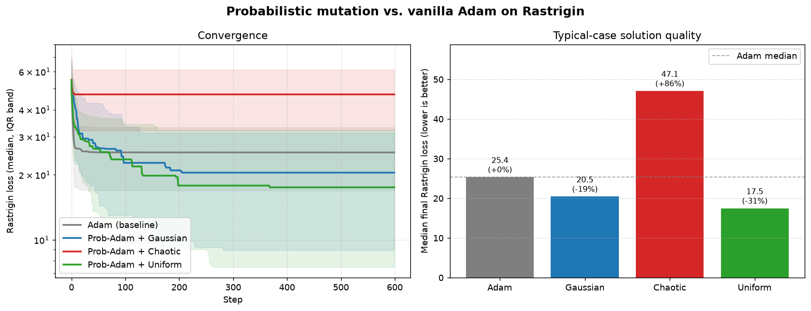
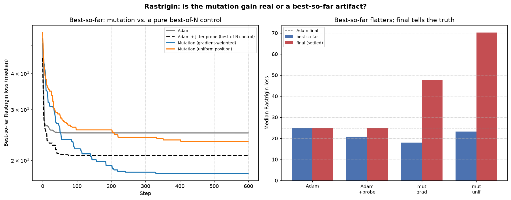
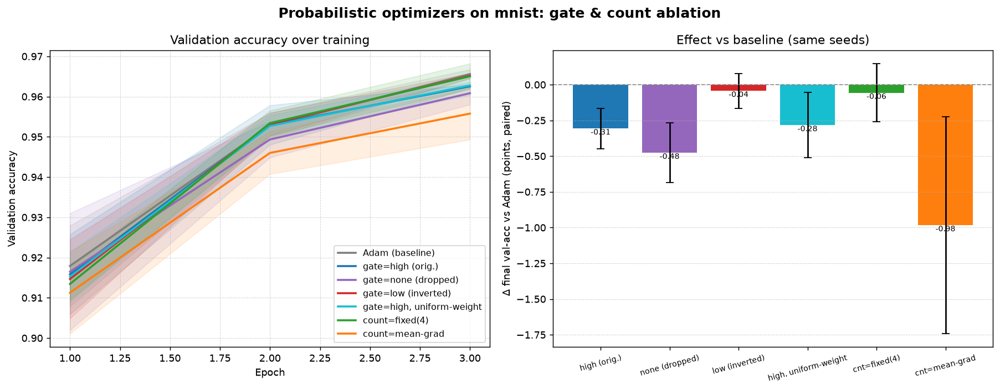

# Probabilistic Optimizers

This repository contains the code for the study "Probabilistic Optimizers:
gradient-weighted parameter resampling as a drop-in exploration hook" by Jeff
Rhoades (@rhoadesScholar), submitted to the FAAFO Consortium of Rhoades.

## Conclusion (TL;DR)

**It doesn't work — and finding out *why* was the fun part.** The idea was to
wrap any optimizer with a hook that resamples high-gradient weights per layer,
with mutation probability set by a softmax over gradient magnitudes. On
Rastrigin it *looked* like a ~20–30% win, but that was an artifact of the
**best-so-far** metric: a controlled best-of-N probe reproduced most of the gain
at zero cost to the deployed model, and the actual settled solution was ~2×
*worse* than plain Adam. On real training (MNIST) and a noisy synthetic task the
verdict is consistent and, over tight paired seeds, statistically clear: every
variant is neutral-to-harmful, the reachable accuracy is never improved, and the
scheme's two central design choices both fail their controls — gating on **high**
gradients is the *worst* gate (perturbing the weights the optimizer is actively
moving fights it hardest; **inverting** the gate to hit stuck weights is the
safest), and the **gradient-weighted softmax buys nothing** over picking the same
weights uniformly. Adaptive mutation counts tied to gradient magnitude are an
outright footgun (they concentrate disruption early, when the model is most
fragile). Net: gradient-weighted resampling is at best a descent-time jitter, not
a better optimizer or a useful regularizer. The lasting lesson for the ledger:
**if a stochastic trick only shines under best-so-far, report the settled iterate
too — it usually tells a different story.** (Full methods, plots, and controls
below.)

## Idea

Take **any** off-the-shelf optimizer (Adam, SGD, ...) and, after each ordinary
update, inject a hook that randomly **resamples ("mutates") individual
parameters, per layer**. The recipe, applied to each parameter tensor:

1. Look at the per-entry gradient magnitude `|g|`.
2. A **gate** decides which entries are *eligible* to mutate: `"high"` (`|g|`
   over a threshold — the still-moving, contested entries), `"low"` (`|g|` under
   the threshold — the stuck / near-dead entries), or `"none"` (drop the gate).
3. Turn the eligible magnitudes into probabilities with a temperature-scaled
   **softmax over the layer** (`weight_by="grad"` gives high-gradient entries
   more mass; `"neg_grad"` favours the small ones).
4. Draw independent Bernoulli mutation decisions from those probabilities,
   scaled so that ~`num_mutations` entries mutate per layer in expectation.
   `num_mutations` can be a constant *or* adaptive (a fraction of the entries
   over the gate, or a multiple of the mean/max gradient).
5. Replace (or perturb) the chosen entries with a **mutator**: a draw from a
   distribution (Gaussian, uniform), a **deterministic chaotic function** (the
   logistic map), or any callable you supply.

The result is a *family* of optimizers — one per (base optimizer × mutator ×
schedule) combination — that behave like the wrapped optimizer but with a tunable
amount of gradient-weighted stochastic exploration folded in.

```python
import torch
from ProbabilisticOptimizers import ProbabilisticOptimizer, ChaoticMutator

base = torch.optim.Adam(model.parameters(), lr=1e-3)
opt = ProbabilisticOptimizer(
    base,
    mutator=ChaoticMutator(additive=True, strength=1e-2),
    threshold=1e-3,      # only mutate high-gradient entries
    num_mutations=2.0,   # ~2 mutated entries per layer per step (in expectation)
    temperature=1.0,     # softmax temperature over |grad|
)
# ...then use `opt` exactly like a normal optimizer.
```

There is also a class factory for the "swap `Adam` for `ProbabilisticAdam`" style:

```python
from ProbabilisticOptimizers import make_probabilistic
ProbAdam = make_probabilistic(torch.optim.Adam)
opt = ProbAdam(model.parameters(), lr=1e-3, num_mutations=2.0)
```

## What the mutation rule actually does

A subtle but important consequence of gating on **high** gradients: at a local
minimum the gradients are ~0 everywhere, so *nothing is eligible* and no mutation
happens. This method therefore does **not** kick a settled model out of a
minimum. Instead it injects exploration **during active descent** — high
gradient magnitude behaves like a high "temperature", much as in simulated
annealing — and biases that exploration toward the entries that are currently
moving the most. Best-so-far tracking then keeps whatever good basin the noisy
trajectory happens to pass through.

## Mutators

| Mutator | Behaviour |
| --- | --- |
| `NormalMutator(std, mean, relative, additive)` | Draw from `Normal(mean, std)`; `relative` scales `std` by `|weight|`. |
| `UniformMutator(low, high, additive)` | Draw from `Uniform(low, high)`. |
| `ChaoticMutator(r, iterations, scale, additive)` | Deterministic logistic-map chaos, seeded from `weight + grad`. No PRNG. |
| `CallableMutator(fn, additive)` | Wrap any `fn(values, grads, generator)`. |

All mutators support `additive=True` (perturb the current value) vs. the default
`additive=False` (fully replace it), and a `strength` multiplier that can be
annealed over training.

## Gates, weighting, and adaptive counts

| Knob | Values | Meaning |
| --- | --- | --- |
| `gate` | `"high"` / `"low"` / `"none"` | Which entries are eligible: over the gate, under it, or all. |
| `threshold_mode` | `"abs"` / `"quantile"` | Interpret `threshold` as an absolute `|grad|` or as a per-layer quantile (scale-free; e.g. `0.5` splits each layer at its median gradient). |
| `weight_by` | `"grad"` / `"neg_grad"` / `"uniform"` | Softmax mass on large vs. small gradients, or ignore the gradient entirely (uniform — the control for whether weighting matters). |
| `num_mutations` | float or callable | Expected mutations per layer, fixed or adaptive. |

Adaptive count strategies (`ProbabilisticOptimizers.mutation_counts`) make the
per-step budget *react* to the gradients:

```python
from ProbabilisticOptimizers import FractionOverGate, GradientScaled

# ~2% of the entries that pass the gate, this step:
num_mutations = FractionOverGate(fraction=0.02)
# scale the count by the mean |grad| (cap it — see the warning below):
num_mutations = GradientScaled(scale=1500.0, stat="mean", max_count=80.0)
```

## Findings

### 1. Non-convex optimisation (Rastrigin)

Benchmark: minimise the **Rastrigin** function (a grid of deep local minima
around a single global minimum at 0) from 60 random starts, wrapping Adam
(`lr=0.05`, 600 steps) with `threshold=0.5`, `num_mutations=3`, `temperature=2`,
and mutation magnitude annealed to 2% over training. This first pass reported the
**best-so-far** loss (the lowest value visited at any step; lower is better):



| Method | best-so-far (median) | escape rate (<1.0) |
| --- | ---: | ---: |
| Adam (baseline) | 25.4 | 3.3% |
| Prob-Adam + Gaussian | 20.5 (**−19%**) | 0% |
| Prob-Adam + Uniform | 17.5 (**−31%**) | 0% |
| Prob-Adam + Chaotic | 47.1 (**+86%**) | 0% |

At face value the Gaussian/uniform mutators look like they *help* (−19%/−31%),
while chaotic hurts and nobody reaches the global basin. **That apparent help was
too good to trust** — see below.

### 1b. Was the Rastrigin gain real? (No — it was mostly a best-so-far artifact)

`best-so-far` is a biased metric for a noisy optimiser: injecting perturbations
and keeping the single luckiest point you ever pass through is a
"best-of-N-samples" estimator — more noise ⇒ more distinct points visited ⇒
lower best-so-far, whether or not the noise actually optimises anything. To
separate real improvement from the artifact we ran matched controls
(`rastrigin_controls.py`, 100 seeds, same annealed dose), reporting both
best-so-far **and** the *final settled* iterate (what you would actually deploy):



| Method | best-so-far | final (settled) |
| --- | ---: | ---: |
| Adam | 24.9 | 24.9 |
| Adam + jitter-probe *(best-of-N control)* | **20.8** | 24.9 |
| Mutation (gradient-weighted) | **18.0** | **47.7** |
| Mutation (uniform position) | 23.2 | 70.2 |

The controls are damning for the original claim:

* **Most of the "gain" is pure best-of-N.** Just probing a *jittered copy* of
  Adam's weights each step — never letting it touch the optimiser's trajectory —
  drops best-so-far from 24.9 to **20.8 at zero cost to the deployed model** (its
  final is still 24.9, identical to Adam). No real exploration; the metric alone
  produces most of the improvement.
* **Committing the mutations makes the actual solution worse.** Gradient-weighted
  mutation posts the best-looking best-so-far (18.0) but its *settled* iterate is
  **47.7 — roughly 2× worse than Adam (24.9)**. The low best-so-far is a lucky
  point it visits and immediately leaves.
* **Gradient weighting does do *something* — just not something useful here.** It
  reaches a lower best-so-far than uniform-position mutation (18.0 vs 23.2), so
  the softmax genuinely steers jumps toward more promising coordinates; but it
  buys a better *lottery ticket*, not a better final model.

**Corrected takeaway:** on Rastrigin this mutation scheme does **not** optimise
better than Adam. The earlier −19%/−31% was the best-so-far metric rewarding
noise; measured by the deployable (final) iterate, mutation is neutral-to-harmful
— consistent with the neural-network results below. Gating on *high* gradients
also means it can never kick a settled model out of a minimum (gradients ≈ 0
there), so it is at best a *descent-time* jitter, not a minimum-escaper. Lesson
for the ledger: **if a stochastic trick only looks good under best-so-far, report
the settled iterate too.**

### 2. Neural-network training — gate & count ablation

An actual training run (see *Running a training run* below), comparing the
**gate** (high / none / inverted) and the **mutation-count** strategy over
matched seeds. Because task difficulty varies across seeds, we report the
**paired** delta vs Adam (same seed).

**MNIST** (real data — small CNN, 8k-example subset, 3 epochs, 3 seeds). This is
the headline because the low seed variance makes several effects statistically
clear (error bars that miss zero are real):



| Config | Δ final val-acc vs Adam (paired) | mut/step |
| --- | ---: | ---: |
| `gate=low` (inverted) | −0.04 ± 0.12 pts | 2069 |
| `count=fixed(4)` | −0.06 ± 0.20 pts | 32 |
| `gate=high, uniform-weight` *(control)* | −0.28 ± 0.23 pts | 2069 |
| `gate=high` (original) | **−0.31 ± 0.14 pts** | 2071 |
| `gate=none` (dropped) | **−0.48 ± 0.21 pts** | 4138 |
| `count=mean-grad` | **−0.98 ± 0.76 pts** | 100 |

**Synthetic** teacher-student task with **20% training-label noise** and a small
train set (so the net overfits and there is a real generalisation gap), 6 seeds.
Same ordering, larger noise — corroborates MNIST:


| Config | Δ final val-acc vs Adam (paired) |
| --- | ---: |
| `gate=high, uniform-weight` *(control)* | +0.39 ± 0.40 pts |
| `gate=low` (inverted) | −0.02 ± 0.34 pts |
| `count=fixed(4)` | −0.03 ± 0.31 pts |
| `count=mean-grad` | −0.13 ± 0.33 pts |
| `gate=none` (dropped) | −0.28 ± 0.48 pts |
| `gate=high` (original) | −0.39 ± 0.86 pts |

What we found — and it **contradicts the going-in hypothesis**:

* **Nothing helps.** No variant beats Adam on either dataset; the reachable peak
  accuracy is unchanged. Weight resampling is not a useful regulariser here.
* **The ordering is consistent across both datasets and against the hypothesis:**
  inverting the gate (`gate=low`, mutating stuck/low-gradient weights) is the
  *most benign* (statistically indistinguishable from Adam on MNIST), while the
  original **`gate=high` is genuinely harmful** (−0.31 pts on MNIST, error bar
  clear of zero). Perturbing the weights Adam is *actively* moving fights the
  optimiser hardest; perturbing near-dead weights barely registers. "Inverting
  will hurt" did **not** hold — it is the *safest* of the three.
* **The gradient-weighting — the defining feature of the whole idea — buys
  nothing.** Replacing the softmax-over-`|grad|` position selection with a
  *uniform* pick over the same eligible set (`gate=high, uniform-weight`) is
  statistically indistinguishable from the gradient-weighted version on MNIST
  (−0.28 vs −0.31) and, on the noisier synthetic task, is if anything *better*
  (+0.39 vs −0.39). So "softmax of gradient magnitudes" is not doing useful work:
  what matters is *that* you perturb high-gradient (actively-learning) weights,
  and that is precisely the harmful part — how you weight within them is noise.
* **Dropping the gate is the worst of the gate choices** (−0.48 pts on MNIST) at
  2× the mutation cost — every entry is eligible, so the fixed fraction resamples
  twice as many weights, for strictly more harm.
* **Adaptive counts are a footgun.** `GradientScaled` (count ∝ mean `|grad|`) is
  the worst config on MNIST (−0.98 pts) and, in an earlier *uncapped* run on the
  synthetic task, **destabilised training badly** (−6.5 ± 12 pts, one seed
  collapsing to 47%). Gradients are largest exactly when the model is most
  fragile (early training), so tying the budget to them concentrates disruption
  at the worst time. If you must, cap it hard.

Net "find out": on ordinary supervised training, gradient-weighted resampling is
neutral at best and harmful otherwise; the *high*-gradient gate — the whole
premise of the original idea — is the *worst* of the gate choices, not the best.

## Setup

Works on Apple-silicon (MPS), CUDA, or CPU — the device is auto-detected.

```bash
git clone https://github.com/rhoadesScholar/FAAFO.git
cd FAAFO/ProbabilisticOptimizers

python3 -m venv .venv && source .venv/bin/activate
pip install torch torchvision numpy matplotlib   # torch/torchvision ship MPS wheels for macOS
pip install -e .
```

## Running a training run

```bash
# Full gate & count ablation on the offline synthetic task (fast on an M-series Mac):
python -m ProbabilisticOptimizers.compare --dataset synthetic --seeds 6 --epochs 25
# -> training_comparison_synthetic.png + training_comparison_synthetic.json

# A single config, verbose:
python -m ProbabilisticOptimizers.train --config gate_low --dataset synthetic --epochs 25

# The real thing on MNIST (downloads on first run; subset for speed):
python -m ProbabilisticOptimizers.compare --dataset mnist --seeds 3 --epochs 3 --subset 8000
```

The device is picked automatically (MPS ▸ CUDA ▸ CPU); override with
`--device cpu`. Optimizer configurations live in
`ProbabilisticOptimizers/train.py` (`OPTIMIZER_CONFIGS`) — add your own gate /
mutator / count combinations there.

## Reproduce the other results

```bash
python -m ProbabilisticOptimizers.experiment          # Rastrigin best-so-far benchmark -> rastrigin_benchmark.png
python -m ProbabilisticOptimizers.rastrigin_controls  # best-of-N controls -> rastrigin_controls.png
python -m ProbabilisticOptimizers.tests               # sanity tests
```
